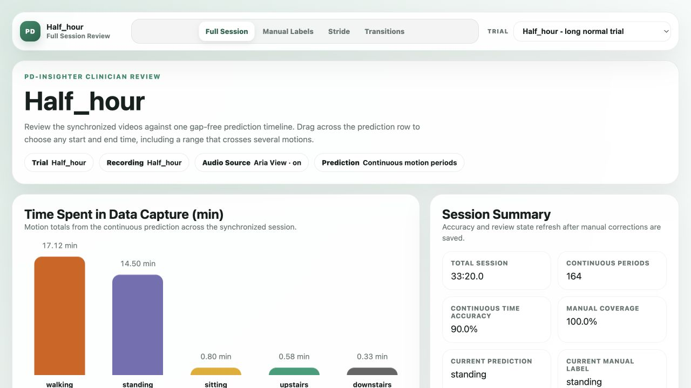
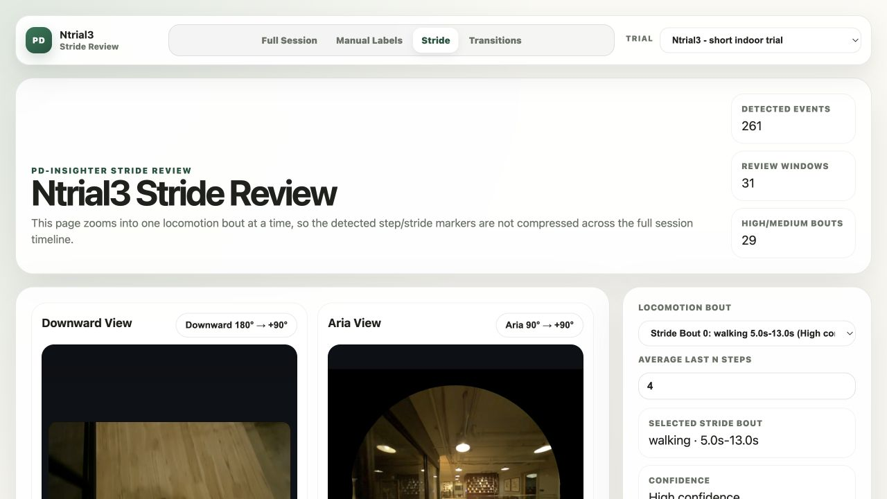

# PD Insighter Research Demo

This is a compact, static version of PD Insighter for research review. It includes two representative trials and requires no Project Aria tools, MPS processing, or raw SLAM downloads.





## Run It

Python 3 is the only requirement.

```bash
git clone https://github.com/nancyLei123/PD-Insighter-Demo.git
cd PD-Insighter-Demo
python3 serve_demo.py
```

The dashboard opens at `http://127.0.0.1:8000`. Keep the terminal open and press `Control+C` to stop it.

## What Is Included

| Trial | Purpose | Duration | Views |
|---|---|---:|---|
| `Half_hour` | Longer normal trial with indoor and outdoor activity | about 33 minutes | Full Session, Manual Labels, Stride, Transitions |
| `Ntrial3` | Short indoor trial for close review of gait and transitions | about 3.6 minutes | Full Session, Manual Labels, Stride, Transitions |

The package is about 239 MiB. It includes derived plots, continuous predictions, transition windows, stride diagnostics, and the saved `Half_hour` manual labels. It does not include raw `.vrs` recordings or raw MPS trajectory and point-cloud files.

## Dashboard Pages

- **Full Session** shows the synchronized videos, continuous prediction bar, saved manual labels, motion totals, and time information.
- **Manual Labels** shows saved labels and supports local review edits. Changes remain in the professor's browser and do not alter Nancy's research files.
- **Stride** shows SLAM height/speed signals, estimated step events, left/right estimates, stride proxies, and synchronized video validation.
- **Transitions** treats motion changes as first-class states, shows their location in the full session, and supports focused playback with surrounding context.

## Important Notes

- The Aria and downward videos remain aligned to the same dashboard time axis.
- The shared audio is carried by the Aria view; the downward view is intentionally silent to prevent echo.
- `Half_hour` uses lightly compressed 15 fps video: Aria is 640 x 640 and downward is 854 x 480. `Ntrial3` keeps its existing higher-quality short-trial video.
- Video compression changes only review quality. Motion predictions and plots were calculated from the original SLAM data before compression.
- This is a research prototype and is not a clinically validated diagnostic system.

## Sharing Safely

Use a separate **private** GitHub repository and invite only approved collaborators. Do not place this demo on a branch of the existing public Qwen repository: branches inherit the repository's public visibility. The videos contain identifiable image and audio data, so do not enable public GitHub Pages or make the repository public without study approval.
